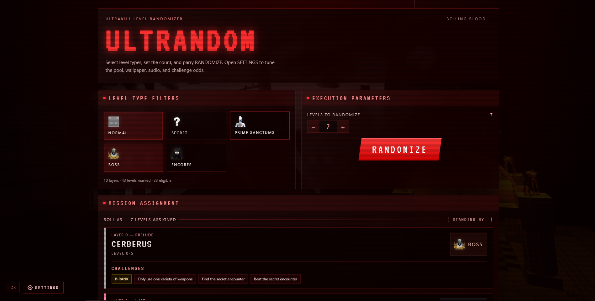

# ULTRANDOM project

*MANKIND IS ACCIDENT. UNCERTAINTY IS FUEL. FORTUNE IS FULL.
Make your act of violence random and spread blood in unique ways,
'cause there is no predictability in gore and there is no understanding in brutality.*

ULTRANDOM is my little fun project designed to diversify the gameplay by choosing random levels + challenges.



ULTRANDOM allows you to filter out locations, layers, pull up P-rank randomization factors, etc., all so that you can train/play
ULTRAKILL even more randomly than ever.

## How to build and run

1. Install source of the project in any comfortable way.
2. Install dependencies of the project:

    ```powershell
    npm i
    ```

3. Run project in development mode:

    ```powershell
    npm run dev
    ```

4. Go to <http://localhost:5173/> (or network address if you used `--host`) and use/contribute to this project.
